[toc]

#行为型
## 工厂模式
意图：定义一个创建对象的接口，让其子类自己决定实例化哪一个工厂类，工厂模式使其创建过程延迟到子类进行。

主要解决：主要解决接口选择的问题。

何时使用：我们明确地计划不同条件下创建不同实例时。

如何解决：让其子类实现工厂接口，返回的也是一个抽象的产品。

关键代码：创建过程在其子类执行。

优点:
1. 创建对象只需要知道名称
2. 扩展性高,增加产品只要扩展工厂类
3. 屏蔽产品的具体实现

缺点:
1. 每增加一个产品都需要增加一个具体类和对象实现工厂,增加类的个数,系统复杂度,依赖

使用场景:
1. 日志记录器: 可记录到多个地方
2. 数据库访问: 可使用多种数据库
3. 服务器连接框架: 可使用多个协议
4. 文件上传服务: 多个文件服务提供商

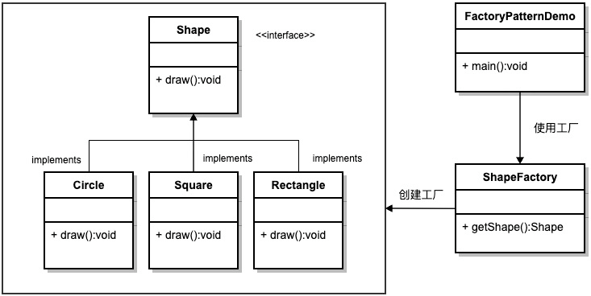

## 抽象工厂模式
意图：提供一个创建一系列相关或相互依赖对象的接口，而无需指定它们具体的类。

主要解决：主要解决接口选择的问题。

何时使用：系统的产品有多于一个的产品族，而系统只消费其中某一族的产品。

如何解决：在一个产品族里面，定义多个产品。

关键代码：在一个工厂里聚合多个同类产品。

优点:
1. 当一个产品族中的多个对象被设计成一起工作时，它能保证客户端始终只使用同一个产品族中的对象。

缺点:
1. 产品族扩展非常困难，要增加一个系列的某一产品，既要在抽象的 Creator 里加代码，又要在具体的里面加代码。

使用场景:
1. QQ 换皮肤，一整套一起换。
2. 生成不同操作系统的程序。

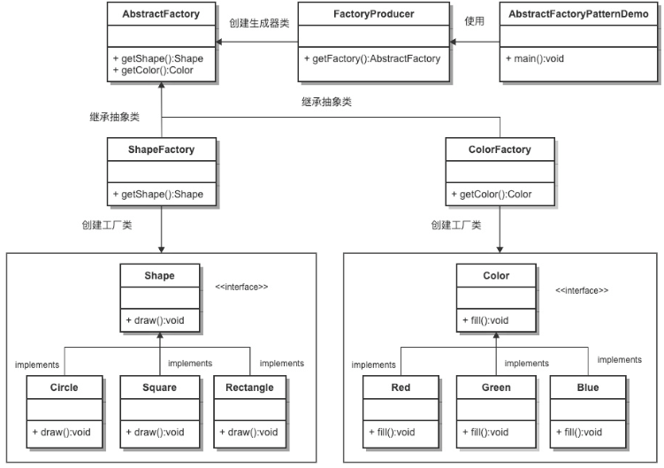

## 单例模式
意图：保证一个类仅有一个实例，并提供一个访问它的全局访问点。

主要解决：一个全局使用的类频繁地创建与销毁。

何时使用：当您想控制实例数目，节省系统资源的时候。

如何解决：判断系统是否已经有这个单例，如果有则返回，如果没有则创建。

关键代码：构造函数是私有的。

优点:
1. 内存里只有一个实例，减少了内存的开销
2. 避免对资源的多重占用（比如写文件操作）

缺点:
1. 没有接口，不能继承，与单一职责原则冲突

使用场景:
1. 要求生产唯一序列号。
2. WEB 中的计数器，不用每次刷新都在数据库里加一次
3. 创建的一个对象需要消耗的资源过多，比如 I/O 与数据库的连接等。

实现方式:
1. 懒汉式，线程不安全

    是否 Lazy 初始化：是
    
    是否多线程安全：否
    
    实现难度：易

    缺点: 不支持多线程
2. 懒汉式，线程安全

    是否 Lazy 初始化：是

    是否多线程安全：是
    
    实现难度：易

    优点: 第一次调用才初始化,避免内存浪费

    缺点: 加锁影响效率
3. 饿汉式

    是否 Lazy 初始化：否

    是否多线程安全：是
    
    实现难度：易
    
    优点: 没有加锁,执行效率高

    缺点: 类加载时就初始化,浪费内存

4. 双重检查锁

    是否 Lazy 初始化：是

    是否多线程安全：是
    
    实现难度：较复杂

    优点: 安全,高性能

5. 登记式/静态内部类

    是否 Lazy 初始化：是
    
    是否多线程安全：是
    
    实现难度：一般
    
    优点: 第三种的升级版

6. 枚举

    是否 Lazy 初始化：否

    是否多线程安全：是
    
    实现难度：易
    
    优点: 支持序列化

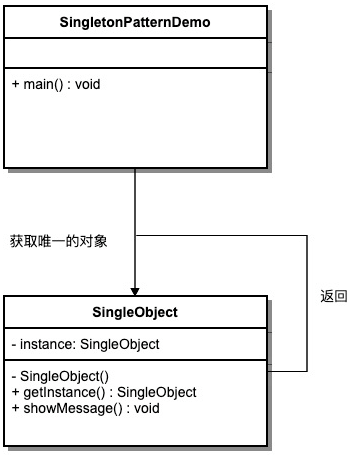

## 建造者模式
意图：将一个复杂的构建与其表示相分离，使得同样的构建过程可以创建不同的表示。

主要解决：构造复杂对象的问题。

何时使用：一些基本部件不会变，而其组合经常变化的时候。

如何解决：将变与不变分离开。

关键代码：建造者：创建和提供实例，导演：管理建造出来的实例的依赖关系。

优点:
1. 建造者独立，易扩展。
2. 便于控制细节风险

缺点:
1. 产品必须有共同点，范围有限制
2. 如内部变化复杂，会有很多的建造类。

使用场景:
1. 需要生成的对象具有复杂的内部结构
2. 需要生成的对象内部属性本身相互依赖。

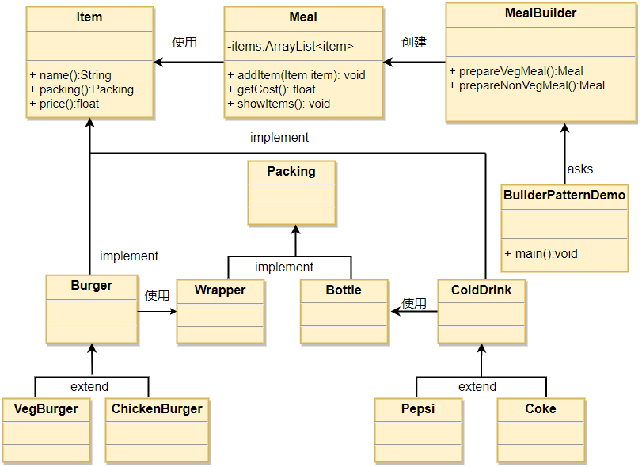

## 原型模式
意图：用原型实例指定创建对象的种类，并且通过拷贝这些原型创建新的对象。

主要解决：在运行期建立和删除原型。

何时使用： 
1、当一个系统应该独立于它的产品创建，构成和表示时。 
2、当要实例化的类是在运行时刻指定时，例如，通过动态装载。 
3、为了避免创建一个与产品类层次平行的工厂类层次时。 
4、当一个类的实例只能有几个不同状态组合中的一种时。

如何解决：利用已有的一个原型对象，快速地生成和原型对象一样的实例。

关键代码：实现cloneable

优点:
1. 性能提高
2. 避免构造函数约束

缺点:
1. 必须实现Cloneable接口
2. 对类功能通盘考虑

使用场景:
1. 资源优化场景
2. 性能和安全要求场景

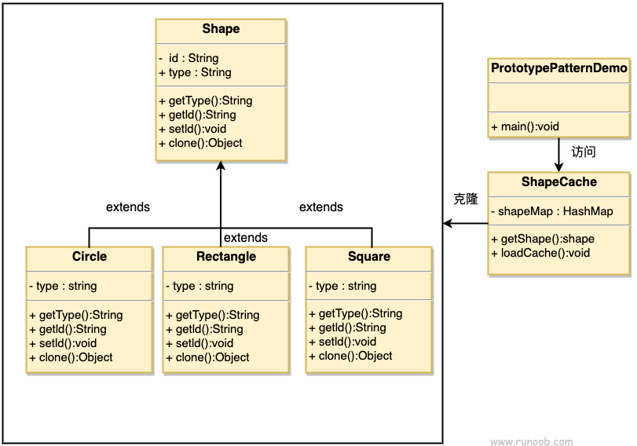

# 结构型
## 适配器模式
意图：将一个类的接口转换成客户希望的另外一个接口

主要解决：将一些"现存的对象"放到新的环境中，而新环境要求的接口是现对象不能满足的

何时使用：
1、系统需要使用现有的类，而此类的接口不符合系统的需要。 
2、想要建立一个可以重复使用的类，用于与一些彼此之间没有太大关联的一些类，包括一些可能在将来引进的类一起工作，这些源类不一定有一致的接口。 
3、通过接口转换，将一个类插入另一个类系中

如何解决：继承或依赖

关键代码：适配器继承或依赖已有的对象，实现想要的目标接口。

优点:
1、可以让任何两个没有关联的类一起运行。 
2、提高了类的复用。 
3、增加了类的透明度。 
4、灵活性好。

缺点:
1. 过多地使用适配器，会让系统非常零乱，不易整体进行把握。
2. 至多只能适配一个适配者类，而且目标类必须是抽象类。

使用场景:
1. 有动机地修改一个正常运行的系统的接口，这时应该考虑使用适配器模式。

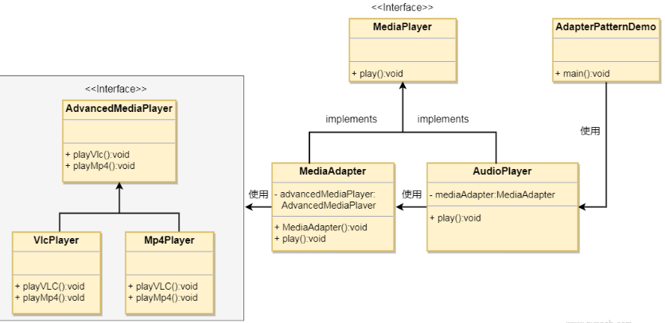

## 桥接模式
意图：将抽象部分与实现部分分离，使它们都可以独立的变化。

主要解决：在有多种可能会变化的情况下，用继承会造成类爆炸问题，扩展起来不灵活。

何时使用：实现系统可能有多个角度分类，每一种角度都可能变化。

如何解决：把这种多角度分类分离出来，让它们独立变化，减少它们之间耦合。

关键代码：抽象类依赖实现类。

优点:
1、抽象和实现的分离。 
2、优秀的扩展能力。 
3、实现细节对客户透明。

缺点:
1. 增加系统的理解与设计难度

使用场景:
1. 系统需要在构件的抽象化角色和具体化角色之间增加更多的灵活性
2. 不希望使用继承或因为多层次继承导致系统类的个数急剧增加
3. 一个类存在两个独立变化的维度，且这两个维度都需要进行扩展

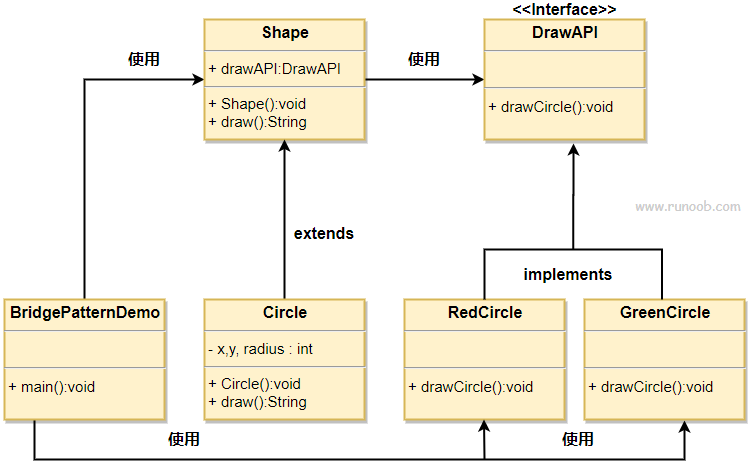

## 过滤器模式
意图：

主要解决：

何时使用：

如何解决：

关键代码：

优点:

缺点:

使用场景:

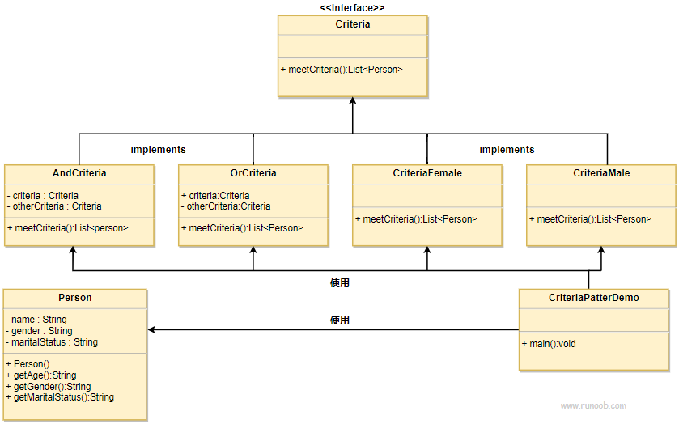

## 组合模式
意图：将对象组合成树形结构以表示"部分-整体"的层次结构

主要解决：树型结构的问题中，模糊了简单元素和复杂元素的概念

何时使用：
1、您想表示对象的部分-整体层次结构（树形结构）。 
2、您希望用户忽略组合对象与单个对象的不同，用户将统一地使用组合结构中的所有对象。

如何解决：树枝和叶子实现统一接口，树枝内部组合该接口。

关键代码：树枝内部组合该接口，并且含有内部属性 List，里面放 Component。

优点:
1、高层模块调用简单。 
2、节点自由增加。

缺点:在使用组合模式时，其叶子和树枝的声明都是实现类，而不是接口，违反了依赖倒置原则。

使用场景: 部分、整体场景，树形菜单，文件、文件夹的管理

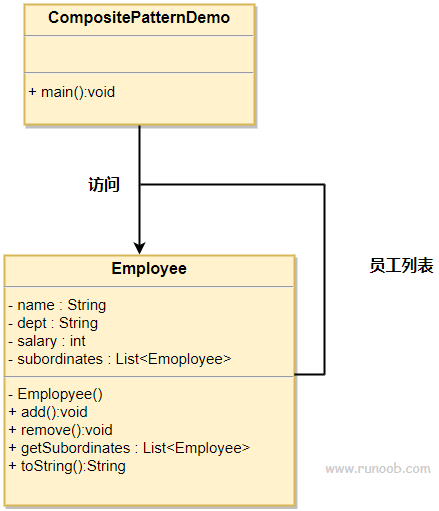

## 装饰器模式
意图：动态地给一个对象添加一些额外的职责

主要解决：随着扩展功能的增多，子类会很膨胀

何时使用：在不想增加很多子类的情况下扩展类

如何解决：将具体功能职责划分，同时继承装饰者模式

关键代码：
1、Component 类充当抽象角色，不应该具体实现。 
2、修饰类引用和继承 Component 类，具体扩展类重写父类方法。

优点:
装饰类和被装饰类可以独立发展，不会相互耦合
装饰模式是继承的一个替代模式，装饰模式可以动态扩展一个实现类的功能。

缺点:
多层装饰比较复杂。

使用场景:
1、扩展一个类的功能。 
2、动态增加功能，动态撤销。

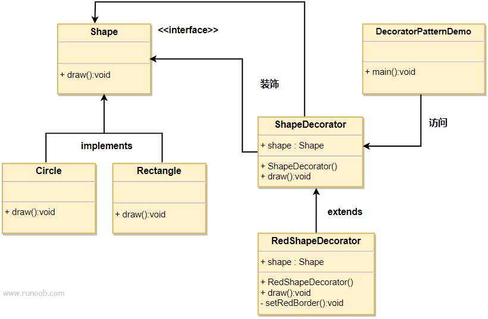

## 外观模式
意图：为子系统中的一组接口提供一个一致的界面，外观模式定义了一个高层接口，这个接口使得这一子系统更加容易使用。

主要解决：降低访问复杂系统的内部子系统时的复杂度，简化客户端之间的接口。

何时使用：
1、客户端不需要知道系统内部的复杂联系，整个系统只需提供一个"接待员"即可。 
2、定义系统的入口。

如何解决：客户端不与系统耦合，外观类与系统耦合。

关键代码：
在客户端和复杂系统之间再加一层，这一层将调用顺序、依赖关系等处理好。

优点:
1、减少系统相互依赖。 
2、提高灵活性。 
3、提高了安全性。

缺点:
不符合开闭原则，如果要改东西很麻烦，继承重写都不合适。

使用场景:
1、为复杂的模块或子系统提供外界访问的模块。 
2、子系统相对独立。 
3、预防低水平人员带来的风险。

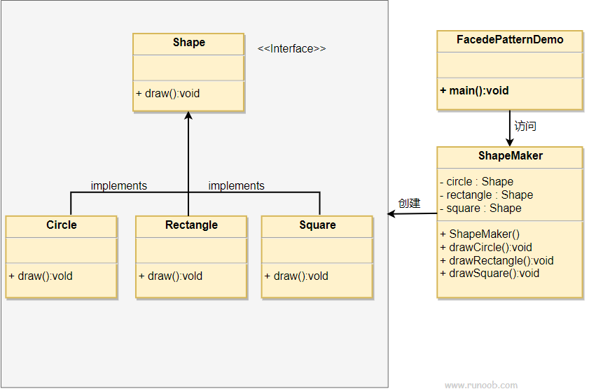

## 享元模式
意图：运用共享技术有效地支持大量细粒度的对象

主要解决：在有大量对象时，有可能会造成内存溢出，我们把其中共同的部分抽象出来，如果有相同的业务请求，直接返回在内存中已有的对象，避免重新创建

何时使用：
1、系统中有大量对象。 
2、这些对象消耗大量内存。 
3、这些对象的状态大部分可以外部化。 
4、这些对象可以按照内蕴状态分为很多组，当把外蕴对象从对象中剔除出来时，每一组对象都可以用一个对象来代替。 
5、系统不依赖于这些对象身份，这些对象是不可分辨的。

如何解决：用唯一标识码判断，如果在内存中有，则返回这个唯一标识码所标识的对象

关键代码：用 HashMap 存储这些对象

优点: 大大减少对象的创建，降低系统的内存，使效率提高。

缺点: 提高了系统的复杂度，需要分离出外部状态和内部状态，而且外部状态具有固有化的性质，不应该随着内部状态的变化而变化，否则会造成系统的混乱。

使用场景:
1、系统有大量相似对象。 
2、需要缓冲池的场景。

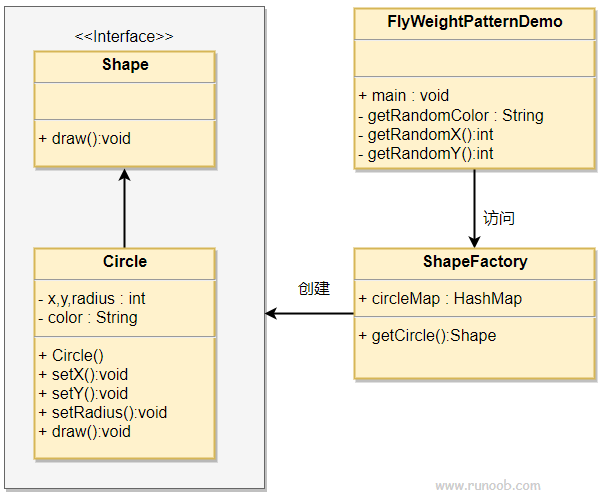

## 代理模式
意图：为其他对象提供一种代理以控制对这个对象的访问。

主要解决：在直接访问对象时带来的问题,安全

何时使用： 想在访问一个类时做一些控制。

如何解决：增加中间层。

关键代码：实现与被代理类组合。

优点: 
1、职责清晰。 
2、高扩展性。 
3、智能化。

缺点: 
1、由于在客户端和真实主题之间增加了代理对象，因此有些类型的代理模式可能会造成请求的处理速度变慢。 
2、实现代理模式需要额外的工作，有些代理模式的实现非常复杂

使用场景:
1、远程代理。 
2、虚拟代理。 
3、Copy-on-Write 代理。 
4、保护（Protect or Access）代理。 
5、Cache代理。 
6、防火墙（Firewall）代理。 
7、同步化（Synchronization）代理。 
8、智能引用（Smart Reference）代理。

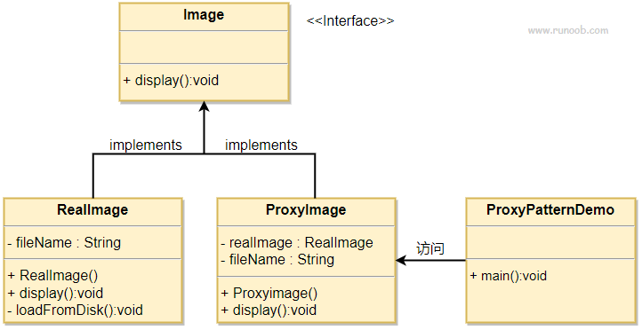