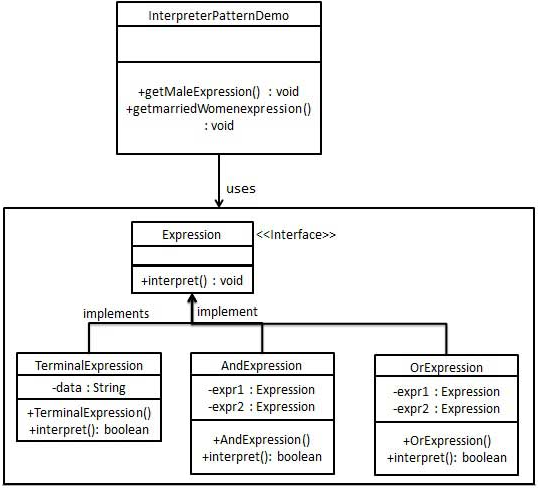
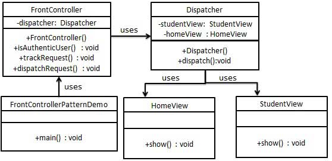
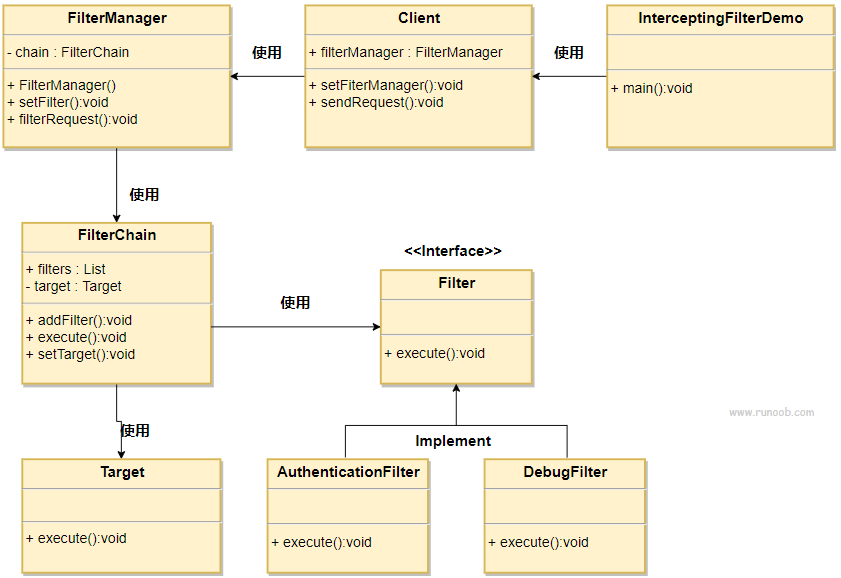

[toc]

简介:
原则:
对接口编程而不是对实现编程。
优先使用对象组合而不是继承。

书籍: 设计模式 - 可复用的面向对象软件元素

用途:
开发人员的共同平台
最佳实践

类型:
- 创建型
- 结构型
- 行为型
- J2EE模式

#创建型
## 工厂模式
意图：定义一个创建对象的接口，让其子类自己决定实例化哪一个工厂类，工厂模式使其创建过程延迟到子类进行。

主要解决：主要解决接口选择的问题。

何时使用：我们明确地计划不同条件下创建不同实例时。

如何解决：让其子类实现工厂接口，返回的也是一个抽象的产品。

关键代码：创建过程在其子类执行。

优点:
1. 创建对象只需要知道名称
2. 扩展性高,增加产品只要扩展工厂类
3. 屏蔽产品的具体实现

缺点:
1. 每增加一个产品都需要增加一个具体类和对象实现工厂,增加类的个数,系统复杂度,依赖

使用场景:
1. 日志记录器: 可记录到多个地方
2. 数据库访问: 可使用多种数据库
3. 服务器连接框架: 可使用多个协议
4. 文件上传服务: 多个文件服务提供商

## 抽象工厂模式
意图：提供一个创建一系列相关或相互依赖对象的接口，而无需指定它们具体的类。

主要解决：主要解决接口选择的问题。

何时使用：系统的产品有多于一个的产品族，而系统只消费其中某一族的产品。

如何解决：在一个产品族里面，定义多个产品。

关键代码：在一个工厂里聚合多个同类产品。

优点:
1. 当一个产品族中的多个对象被设计成一起工作时，它能保证客户端始终只使用同一个产品族中的对象。

缺点:
1. 产品族扩展非常困难，要增加一个系列的某一产品，既要在抽象的 Creator 里加代码，又要在具体的里面加代码。

使用场景:
1. QQ 换皮肤，一整套一起换。
2. 生成不同操作系统的程序。

## 单例模式
意图：保证一个类仅有一个实例，并提供一个访问它的全局访问点。

主要解决：一个全局使用的类频繁地创建与销毁。

何时使用：当您想控制实例数目，节省系统资源的时候。

如何解决：判断系统是否已经有这个单例，如果有则返回，如果没有则创建。

关键代码：构造函数是私有的。

优点:
1. 内存里只有一个实例，减少了内存的开销
2. 避免对资源的多重占用（比如写文件操作）

缺点:
1. 没有接口，不能继承，与单一职责原则冲突

使用场景:
1. 要求生产唯一序列号。
2. WEB 中的计数器，不用每次刷新都在数据库里加一次
3. 创建的一个对象需要消耗的资源过多，比如 I/O 与数据库的连接等。

实现方式:
1. 懒汉式，线程不安全

    是否 Lazy 初始化：是
    
    是否多线程安全：否
    
    实现难度：易

    缺点: 不支持多线程
2. 懒汉式，线程安全

    是否 Lazy 初始化：是

    是否多线程安全：是
    
    实现难度：易

    优点: 第一次调用才初始化,避免内存浪费

    缺点: 加锁影响效率
3. 饿汉式

    是否 Lazy 初始化：否

    是否多线程安全：是
    
    实现难度：易
    
    优点: 没有加锁,执行效率高

    缺点: 类加载时就初始化,浪费内存

4. 双重检查锁

    是否 Lazy 初始化：是

    是否多线程安全：是
    
    实现难度：较复杂

    优点: 安全,高性能

5. 登记式/静态内部类

    是否 Lazy 初始化：是
    
    是否多线程安全：是
    
    实现难度：一般
    
    优点: 第三种的升级版

6. 枚举

    是否 Lazy 初始化：否

    是否多线程安全：是
    
    实现难度：易
    
    优点: 支持序列化

## 建造者模式
意图：将一个复杂的构建与其表示相分离，使得同样的构建过程可以创建不同的表示。

主要解决：构造复杂对象的问题。

何时使用：一些基本部件不会变，而其组合经常变化的时候。

如何解决：将变与不变分离开。

关键代码：建造者：创建和提供实例，导演：管理建造出来的实例的依赖关系。

优点:
1. 建造者独立，易扩展。
2. 便于控制细节风险

缺点:
1. 产品必须有共同点，范围有限制
2. 如内部变化复杂，会有很多的建造类。

使用场景:
1. 需要生成的对象具有复杂的内部结构
2. 需要生成的对象内部属性本身相互依赖。

## 原型模式
意图：用原型实例指定创建对象的种类，并且通过拷贝这些原型创建新的对象。

主要解决：在运行期建立和删除原型。

何时使用： 
1、当一个系统应该独立于它的产品创建，构成和表示时。 
2、当要实例化的类是在运行时刻指定时，例如，通过动态装载。 
3、为了避免创建一个与产品类层次平行的工厂类层次时。 
4、当一个类的实例只能有几个不同状态组合中的一种时。

如何解决：利用已有的一个原型对象，快速地生成和原型对象一样的实例。

关键代码：实现cloneable

优点:
1. 性能提高
2. 避免构造函数约束

缺点:
1. 必须实现Cloneable接口
2. 对类功能通盘考虑

使用场景:
1. 资源优化场景
2. 性能和安全要求场景

# 结构型
## 适配器模式
意图：将一个类的接口转换成客户希望的另外一个接口

主要解决：将一些"现存的对象"放到新的环境中，而新环境要求的接口是现对象不能满足的

何时使用：
1、系统需要使用现有的类，而此类的接口不符合系统的需要。 
2、想要建立一个可以重复使用的类，用于与一些彼此之间没有太大关联的一些类，包括一些可能在将来引进的类一起工作，这些源类不一定有一致的接口。 
3、通过接口转换，将一个类插入另一个类系中

如何解决：继承或依赖

关键代码：适配器继承或依赖已有的对象，实现想要的目标接口。

优点:
1、可以让任何两个没有关联的类一起运行。 
2、提高了类的复用。 
3、增加了类的透明度。 
4、灵活性好。

缺点:
1. 过多地使用适配器，会让系统非常零乱，不易整体进行把握。
2. 至多只能适配一个适配者类，而且目标类必须是抽象类。

使用场景:
1. 有动机地修改一个正常运行的系统的接口，这时应该考虑使用适配器模式。

## 桥接模式
意图：将抽象部分与实现部分分离，使它们都可以独立的变化。

主要解决：在有多种可能会变化的情况下，用继承会造成类爆炸问题，扩展起来不灵活。

何时使用：实现系统可能有多个角度分类，每一种角度都可能变化。

如何解决：把这种多角度分类分离出来，让它们独立变化，减少它们之间耦合。

关键代码：抽象类依赖实现类。

优点:
1、抽象和实现的分离。 
2、优秀的扩展能力。 
3、实现细节对客户透明。

缺点:
1. 增加系统的理解与设计难度

使用场景:
1. 系统需要在构件的抽象化角色和具体化角色之间增加更多的灵活性
2. 不希望使用继承或因为多层次继承导致系统类的个数急剧增加
3. 一个类存在两个独立变化的维度，且这两个维度都需要进行扩展

## 过滤器模式
意图：

主要解决：

何时使用：

如何解决：

关键代码：

优点:

缺点:

使用场景:

## 组合模式
意图：将对象组合成树形结构以表示"部分-整体"的层次结构

主要解决：树型结构的问题中，模糊了简单元素和复杂元素的概念

何时使用：
1、您想表示对象的部分-整体层次结构（树形结构）。 
2、您希望用户忽略组合对象与单个对象的不同，用户将统一地使用组合结构中的所有对象。

如何解决：树枝和叶子实现统一接口，树枝内部组合该接口。

关键代码：树枝内部组合该接口，并且含有内部属性 List，里面放 Component。

优点:
1、高层模块调用简单。 
2、节点自由增加。

缺点:在使用组合模式时，其叶子和树枝的声明都是实现类，而不是接口，违反了依赖倒置原则。

使用场景: 部分、整体场景，树形菜单，文件、文件夹的管理

## 装饰器模式
意图：动态地给一个对象添加一些额外的职责

主要解决：随着扩展功能的增多，子类会很膨胀

何时使用：在不想增加很多子类的情况下扩展类

如何解决：将具体功能职责划分，同时继承装饰者模式

关键代码：
1、Component 类充当抽象角色，不应该具体实现。 
2、修饰类引用和继承 Component 类，具体扩展类重写父类方法。

优点:
装饰类和被装饰类可以独立发展，不会相互耦合
装饰模式是继承的一个替代模式，装饰模式可以动态扩展一个实现类的功能。

缺点:
多层装饰比较复杂。

使用场景:
1、扩展一个类的功能。 
2、动态增加功能，动态撤销。

## 外观模式
意图：为子系统中的一组接口提供一个一致的界面，外观模式定义了一个高层接口，这个接口使得这一子系统更加容易使用。

主要解决：降低访问复杂系统的内部子系统时的复杂度，简化客户端之间的接口。

何时使用：
1、客户端不需要知道系统内部的复杂联系，整个系统只需提供一个"接待员"即可。 
2、定义系统的入口。

如何解决：客户端不与系统耦合，外观类与系统耦合。

关键代码：
在客户端和复杂系统之间再加一层，这一层将调用顺序、依赖关系等处理好。

优点:
1、减少系统相互依赖。 
2、提高灵活性。 
3、提高了安全性。

缺点:
不符合开闭原则，如果要改东西很麻烦，继承重写都不合适。

使用场景:
1、为复杂的模块或子系统提供外界访问的模块。 
2、子系统相对独立。 
3、预防低水平人员带来的风险。

## 享元模式
意图：运用共享技术有效地支持大量细粒度的对象

主要解决：在有大量对象时，有可能会造成内存溢出，我们把其中共同的部分抽象出来，如果有相同的业务请求，直接返回在内存中已有的对象，避免重新创建

何时使用：
1、系统中有大量对象。 
2、这些对象消耗大量内存。 
3、这些对象的状态大部分可以外部化。 
4、这些对象可以按照内蕴状态分为很多组，当把外蕴对象从对象中剔除出来时，每一组对象都可以用一个对象来代替。 
5、系统不依赖于这些对象身份，这些对象是不可分辨的。

如何解决：用唯一标识码判断，如果在内存中有，则返回这个唯一标识码所标识的对象

关键代码：用 HashMap 存储这些对象

优点: 大大减少对象的创建，降低系统的内存，使效率提高。

缺点: 提高了系统的复杂度，需要分离出外部状态和内部状态，而且外部状态具有固有化的性质，不应该随着内部状态的变化而变化，否则会造成系统的混乱。

使用场景:
1、系统有大量相似对象。 
2、需要缓冲池的场景。

## 代理模式
意图：为其他对象提供一种代理以控制对这个对象的访问。

主要解决：在直接访问对象时带来的问题,安全

何时使用： 想在访问一个类时做一些控制。

如何解决：增加中间层。

关键代码：实现与被代理类组合。

优点: 
1、职责清晰。 
2、高扩展性。 
3、智能化。

缺点: 
1、由于在客户端和真实主题之间增加了代理对象，因此有些类型的代理模式可能会造成请求的处理速度变慢。 
2、实现代理模式需要额外的工作，有些代理模式的实现非常复杂

使用场景:
1、远程代理。 
2、虚拟代理。 
3、Copy-on-Write 代理。 
4、保护（Protect or Access）代理。 
5、Cache代理。 
6、防火墙（Firewall）代理。 
7、同步化（Synchronization）代理。 
8、智能引用（Smart Reference）代理。

## 责任链模式
意图：避免请求发送者与接收者耦合在一起，让多个对象都有可能接收请求，将这些对象连接成一条链，并且沿着这条链传递请求，直到有对象处理它为止。

主要解决：职责链上的处理者负责处理请求，客户只需要将请求发送到职责链上即可，无须关心请求的处理细节和请求的传递，所以职责链将请求的发送者和请求的处理者解耦了。

何时使用：在处理消息的时候以过滤很多道。

如何解决：拦截的类都实现统一接口。

关键代码：Handler 里面聚合它自己，在 HandlerRequest 里判断是否合适，如果没达到条件则向下传递，向谁传递之前 set 进去。

优点： 
1、降低耦合度。它将请求的发送者和接收者解耦。 
2、简化了对象。使得对象不需要知道链的结构。 
3、增强给对象指派职责的灵活性。通过改变链内的成员或者调动它们的次序，允许动态地新增或者删除责任。 4、增加新的请求处理类很方便。

缺点： 
1、不能保证请求一定被接收。 
2、系统性能将受到一定影响，而且在进行代码调试时不太方便，可能会造成循环调用。 
3、可能不容易观察运行时的特征，有碍于除错。

使用场景:
1、有多个对象可以处理同一个请求，具体哪个对象处理该请求由运行时刻自动确定。 
2、在不明确指定接收者的情况下，向多个对象中的一个提交一个请求。 
3、可动态指定一组对象处理请求。

## 命令模式
意图：将一个请求封装成一个对象，从而使您可以用不同的请求对客户进行参数化。

主要解决：在软件系统中，行为请求者与行为实现者通常是一种紧耦合的关系，但某些场合，比如需要对行为进行记录、撤销或重做、事务等处理时，这种无法抵御变化的紧耦合的设计就不太合适。

何时使用：在某些场合，比如要对行为进行"记录、撤销/重做、事务"等处理，这种无法抵御变化的紧耦合是不合适的。在这种情况下，如何将"行为请求者"与"行为实现者"解耦？将一组行为抽象为对象，可以实现二者之间的松耦合。

如何解决：通过调用者调用接受者执行命令，顺序：调用者→命令→接受者。

关键代码：
1、received 真正的命令执行对象 
2、Command 
3、invoker 使用命令对象的入口

优点： 
1、降低了系统耦合度。 
2、新的命令可以很容易添加到系统中去。

缺点：使用命令模式可能会导致某些系统有过多的具体命令类。

使用场景:
1、GUI 中每一个按钮都是一条命令。 
2、模拟 CMD。

## 解释器模式
意图：给定一个语言，定义它的文法表示，并定义一个解释器，这个解释器使用该标识来解释语言中的句子。

主要解决：对于一些固定文法构建一个解释句子的解释器。

何时使用：如果一种特定类型的问题发生的频率足够高，那么可能就值得将该问题的各个实例表述为一个简单语言中的句子。这样就可以构建一个解释器，该解释器通过解释这些句子来解决该问题。

如何解决：构建语法树，定义终结符与非终结符。

关键代码：构建环境类，包含解释器之外的一些全局信息，一般是 HashMap。

优点：
1、可扩展性比较好，灵活。 
2、增加了新的解释表达式的方式。 
3、易于实现简单文法。

缺点：
1、可利用场景比较少。 
2、对于复杂的文法比较难维护。 
3、解释器模式会引起类膨胀。 
4、解释器模式采用递归调用方法。

使用场景:
1、可以将一个需要解释执行的语言中的句子表示为一个抽象语法树。 
2、一些重复出现的问题可以用一种简单的语言来进行表达。 
3、一个简单语法需要解释的场景
可使用expression4J代替

## 迭代器模式
意图：提供一种方法顺序访问一个聚合对象中各个元素, 而又无须暴露该对象的内部表示。

主要解决：不同的方式来遍历整个整合对象。

何时使用：遍历一个聚合对象。

如何解决：把在元素之间游走的责任交给迭代器，而不是聚合对象。

关键代码：定义接口：hasNext, next。

优点：
1、它支持以不同的方式遍历一个聚合对象。 
2、迭代器简化了聚合类。 
3、在同一个聚合上可以有多个遍历。 
4、在迭代器模式中，增加新的聚合类和迭代器类都很方便，无须修改原有代码。

缺点：
1、由于迭代器模式将存储数据和遍历数据的职责分离，增加新的聚合类需要对应增加新的迭代器类，类的个数成对增加，这在一定程度上增加了系统的复杂性。

使用场景:
1、访问一个聚合对象的内容而无须暴露它的内部表示。 
2、需要为聚合对象提供多种遍历方式。 
3、为遍历不同的聚合结构提供一个统一的接口。

## 中介者模式
意图：用一个中介对象来封装一系列的对象交互，中介者使各对象不需要显式地相互引用，从而使其耦合松散，而且可以独立地改变它们之间的交互。

主要解决：对象与对象之间存在大量的关联关系，这样势必会导致系统的结构变得很复杂，同时若一个对象发生改变，我们也需要跟踪与之相关联的对象，同时做出相应的处理。

何时使用：多个类相互耦合，形成了网状结构。

如何解决：将上述网状结构分离为星型结构。

关键代码：对象 Colleague 之间的通信封装到一个类中单独处理。

优点：
1、降低了类的复杂度，将一对多转化成了一对一。 
2、各个类之间的解耦。 
3、符合迪米特原则

缺点：
1、中介者会庞大，变得复杂难以维护。

使用场景:
1、系统中对象之间存在比较复杂的引用关系，导致它们之间的依赖关系结构混乱而且难以复用该对象。 
2、想通过一个中间类来封装多个类中的行为，而又不想生成太多的子类

## 备忘录模式
意图：在不破坏封装性的前提下，捕获一个对象的内部状态，并在该对象之外保存这个状态。

主要解决：所谓备忘录模式就是在不破坏封装的前提下，捕获一个对象的内部状态，并在该对象之外保存这个状态，这样可以在以后将对象恢复到原先保存的状态。

何时使用：很多时候我们总是需要记录一个对象的内部状态，这样做的目的就是为了允许用户取消不确定或者错误的操作，能够恢复到他原先的状态，使得他有"后悔药"可吃。

如何解决：通过一个备忘录类专门存储对象状态。

关键代码：客户不与备忘录类耦合，与备忘录管理类耦合。

优点：
1、给用户提供了一种可以恢复状态的机制，可以使用户能够比较方便地回到某个历史的状态。 
2、实现了信息的封装，使得用户不需要关心状态的保存细节。

缺点：
1、消耗资源。如果类的成员变量过多，势必会占用比较大的资源，而且每一次保存都会消耗一定的内存。

使用场景:
1、需要保存/恢复数据的相关状态场景。 
2、提供一个可回滚的操作。

## 观察者模式
意图：定义对象间的一种一对多的依赖关系，当一个对象的状态发生改变时，所有依赖于它的对象都得到通知并被自动更新。

主要解决：一个对象状态改变给其他对象通知的问题，而且要考虑到易用和低耦合，保证高度的协作。

何时使用：一个对象（目标对象）的状态发生改变，所有的依赖对象（观察者对象）都将得到通知，进行广播通知。

如何解决：使用面向对象技术，可以将这种依赖关系弱化。

关键代码：在抽象类里有一个 ArrayList 存放观察者们。

优点：
1、观察者和被观察者是抽象耦合的。 
2、建立一套触发机制。

缺点：
1、如果一个被观察者对象有很多的直接和间接的观察者的话，将所有的观察者都通知到会花费很多时间。 
2、如果在观察者和观察目标之间有循环依赖的话，观察目标会触发它们之间进行循环调用，可能导致系统崩溃。 
3、观察者模式没有相应的机制让观察者知道所观察的目标对象是怎么发生变化的，而仅仅只是知道观察目标发生了变化。

使用场景:
1.一个抽象模型有两个方面，其中一个方面依赖于另一个方面。将这些方面封装在独立的对象中使它们可以各自独立地改变和复用。
2.一个对象的改变将导致其他一个或多个对象也发生改变，而不知道具体有多少对象将发生改变，可以降低对象之间的耦合度。
3.一个对象必须通知其他对象，而并不知道这些对象是谁。
4.需要在系统中创建一个触发链，A对象的行为将影响B对象，B对象的行为将影响C对象……，可以使用观察者模式创建一种链式触发机制。

## 状态模式
意图：允许对象在内部状态发生改变时改变它的行为，对象看起来好像修改了它的类。

主要解决：对象的行为依赖于它的状态（属性），并且可以根据它的状态改变而改变它的相关行为。

何时使用：代码中包含大量与对象状态有关的条件语句。

如何解决：将各种具体的状态类抽象出来。

关键代码：
通常命令模式的接口中只有一个方法。而状态模式的接口中有一个或者多个方法。
而且，状态模式的实现类的方法，一般返回值，或者是改变实例变量的值。
也就是说，状态模式一般和对象的状态有关。
实现类的方法有不同的功能，覆盖接口中的方法。
状态模式和命令模式一样，也可以用于消除 if...else 等条件选择语句。

优点：
1、封装了转换规则。 
2、枚举可能的状态，在枚举状态之前需要确定状态种类。 
3、将所有与某个状态有关的行为放到一个类中，并且可以方便地增加新的状态，只需要改变对象状态即可改变对象的行为。 
4、允许状态转换逻辑与状态对象合成一体，而不是某一个巨大的条件语句块。 
5、可以让多个环境对象共享一个状态对象，从而减少系统中对象的个数。

缺点：
1、状态模式的使用必然会增加系统类和对象的个数。 
2、状态模式的结构与实现都较为复杂，如果使用不当将导致程序结构和代码的混乱。 
3、状态模式对"开闭原则"的支持并不太好，对于可以切换状态的状态模式，增加新的状态类需要修改那些负责状态转换的源代码，否则无法切换到新增状态，而且修改某个状态类的行为也需修改对应类的源代码。

使用场景:
1、行为随状态改变而改变的场景。 
2、条件、分支语句的代替者。

## 空对象模式
意图：一个空对象取代 NULL 对象实例的检查。Null 对象不是检查空值，而是反应一个不做任何动作的关系。这样的 Null 对象也可以在数据不可用的时候提供默认的行为。

主要解决：

何时使用：

如何解决：

关键代码：

优点：

缺点：

使用场景:

## 策略模式
意图：定义一系列的算法,把它们一个个封装起来, 并且使它们可相互替换。

主要解决：在有多种算法相似的情况下，使用 if...else 所带来的复杂和难以维护。

何时使用：一个系统有许多许多类，而区分它们的只是他们直接的行为。

如何解决：将这些算法封装成一个一个的类，任意地替换。

关键代码：实现同一个接口。

优点：
1、算法可以自由切换。 
2、避免使用多重条件判断。 
3、扩展性良好。

缺点：
1、策略类会增多。 
2、所有策略类都需要对外暴露。

使用场景:
1、如果在一个系统里面有许多类，它们之间的区别仅在于它们的行为，那么使用策略模式可以动态地让一个对象在许多行为中选择一种行为。 
2、一个系统需要动态地在几种算法中选择一种。 
3、如果一个对象有很多的行为，如果不用恰当的模式，这些行为就只好使用多重的条件选择语句来实现。

## 模板模式
意图：定义一个操作中的算法的骨架，而将一些步骤延迟到子类中。模板方法使得子类可以不改变一个算法的结构即可重定义该算法的某些特定步骤。

主要解决：一些方法通用，却在每一个子类都重新写了这一方法。

何时使用：有一些通用的方法。

如何解决：将这些通用算法抽象出来。

关键代码：在抽象类实现，其他步骤在子类实现。

优点：
1、封装不变部分，扩展可变部分。 
2、提取公共代码，便于维护。 
3、行为由父类控制，子类实现。

缺点：
1、每一个不同的实现都需要一个子类来实现，导致类的个数增加，使得系统更加庞大。

使用场景:
1、有多个子类共有的方法，且逻辑相同。 
2、重要的、复杂的方法，可以考虑作为模板方法。

## 访问者模式
意图：主要将数据结构与数据操作分离。

主要解决：稳定的数据结构和易变的操作耦合问题。

何时使用：需要对一个对象结构中的对象进行很多不同的并且不相关的操作，而需要避免让这些操作"污染"这些对象的类，使用访问者模式将这些封装到类中。

如何解决：在被访问的类里面加一个对外提供接待访问者的接口。

关键代码：在数据基础类里面有一个方法接受访问者，将自身引用传入访问者。

优点：
1、符合单一职责原则。 
2、优秀的扩展性。 
3、灵活性。

缺点：
1、具体元素对访问者公布细节，违反了迪米特原则。 
2、具体元素变更比较困难。 
3、违反了依赖倒置原则，依赖了具体类，没有依赖抽象。

使用场景:
1、对象结构中对象对应的类很少改变，但经常需要在此对象结构上定义新的操作。 
2、需要对一个对象结构中的对象进行很多不同的并且不相关的操作，而需要避免让这些操作"污染"这些对象的类，也不希望在增加新操作时修改这些类。

# J2EE
## MVC模式
意图：应用程序的分层开发

Model（模型） - 模型代表一个存取数据的对象或 JAVA POJO。它也可以带有逻辑，在数据变化时更新控制器。
View（视图） - 视图代表模型包含的数据的可视化。
Controller（控制器） - 控制器作用于模型和视图上。它控制数据流向模型对象，并在数据变化时更新视图。它使视图与模型分离开。

## 业务代表模式
意图：对表示层和业务层解耦

客户端（Client） - 表示层代码可以是 JSP、servlet 或 UI java 代码。
业务代表（Business Delegate） - 一个为客户端实体提供的入口类，它提供了对业务服务方法的访问。
查询服务（LookUp Service） - 查找服务对象负责获取相关的业务实现，并提供业务对象对业务代表对象的访问。
业务服务（Business Service） - 业务服务接口。实现了该业务服务的实体类，提供了实际的业务实现逻辑。

## 组合实体模式
意图：EJB

组合实体（Composite Entity） - 它是主要的实体 bean。它可以是粗粒的，或者可以包含一个粗粒度对象，用于持续生命周期。
粗粒度对象（Coarse-Grained Object） - 该对象包含依赖对象。它有自己的生命周期，也能管理依赖对象的生命周期。
依赖对象（Dependent Object） - 依赖对象是一个持续生命周期依赖于粗粒度对象的对象。
策略（Strategies） - 策略表示如何实现组合实体。

## 数据访问对象模式
意图：把低级的数据访问 API 或操作从高级的业务服务中分离出来

数据访问对象接口（Data Access Object Interface） - 该接口定义了在一个模型对象上要执行的标准操作。
数据访问对象实体类（Data Access Object concrete class） - 该类实现了上述的接口。该类负责从数据源获取数据，数据源可以是数据库，也可以是 xml，或者是其他的存储机制。
模型对象/数值对象（Model Object/Value Object） - 该对象是简单的 POJO，包含了 get/set 方法来存储通过使用 DAO 类检索到的数据。

## 前端控制器模式
意图：提供一个集中的请求处理机制，所有的请求都将由一个单一的处理程序处理。该处理程序可以做认证/授权/记录日志，或者跟踪请求，然后把请求传给相应的处理程序

前端控制器（Front Controller） - 处理应用程序所有类型请求的单个处理程序，应用程序可以是基于 web 的应用程序，也可以是基于桌面的应用程序。
调度器（Dispatcher） - 前端控制器可能使用一个调度器对象来调度请求到相应的具体处理程序。
视图（View） - 视图是为请求而创建的对象。

## 拦截过滤器模式
意图：对应用程序的请求或响应做一些预处理/后处理。定义过滤器，并在把请求传给实际目标应用程序之前应用在请求上。过滤器可以做认证/授权/记录日志，或者跟踪请求，然后把请求传给相应的处理程序

过滤器（Filter） - 过滤器在请求处理程序执行请求之前或之后，执行某些任务。
过滤器链（Filter Chain） - 过滤器链带有多个过滤器，并在 Target 上按照定义的顺序执行这些过滤器。
Target - Target 对象是请求处理程序。
过滤管理器（Filter Manager） - 过滤管理器管理过滤器和过滤器链。
客户端（Client） - Client 是向 Target 对象发送请求的对象。

## 服务定位器模式
意图：在首次请求某个服务时，服务定位器在 JNDI 中查找服务，并缓存该服务对象

服务（Service） - 实际处理请求的服务。对这种服务的引用可以在 JNDI 服务器中查找到。
Context / 初始的 Context - JNDI Context 带有对要查找的服务的引用。
服务定位器（Service Locator） - 服务定位器是通过 JNDI 查找和缓存服务来获取服务的单点接触。
缓存（Cache） - 缓存存储服务的引用，以便复用它们。
客户端（Client） - Client 是通过 ServiceLocator 调用服务的对象。

## 传输对象模式
意图：从客户端向服务器一次性传递带有多个属性的数据

业务对象（Business Object） - 为传输对象填充数据的业务服务。
传输对象（Transfer Object） - 简单的 POJO，只有设置/获取属性的方法。
客户端（Client） - 客户端可以发送请求或者发送传输对象到业务对象。

